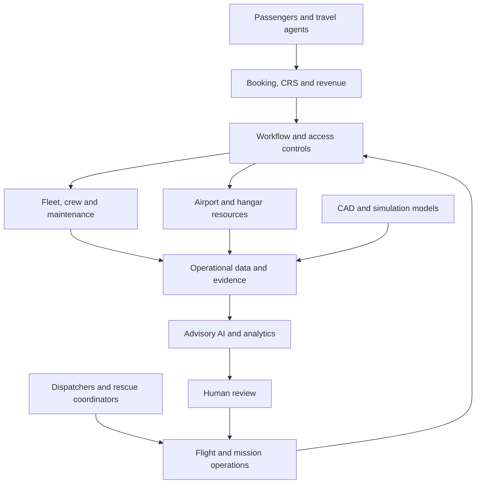
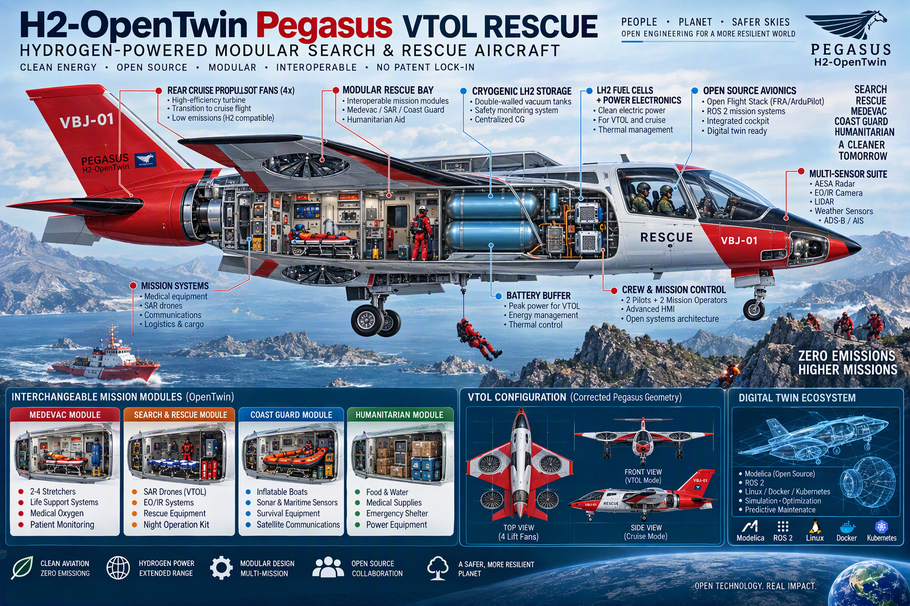
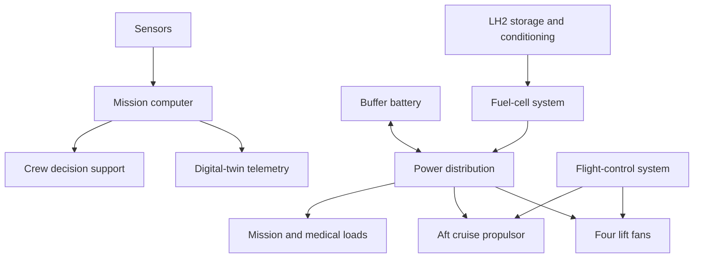
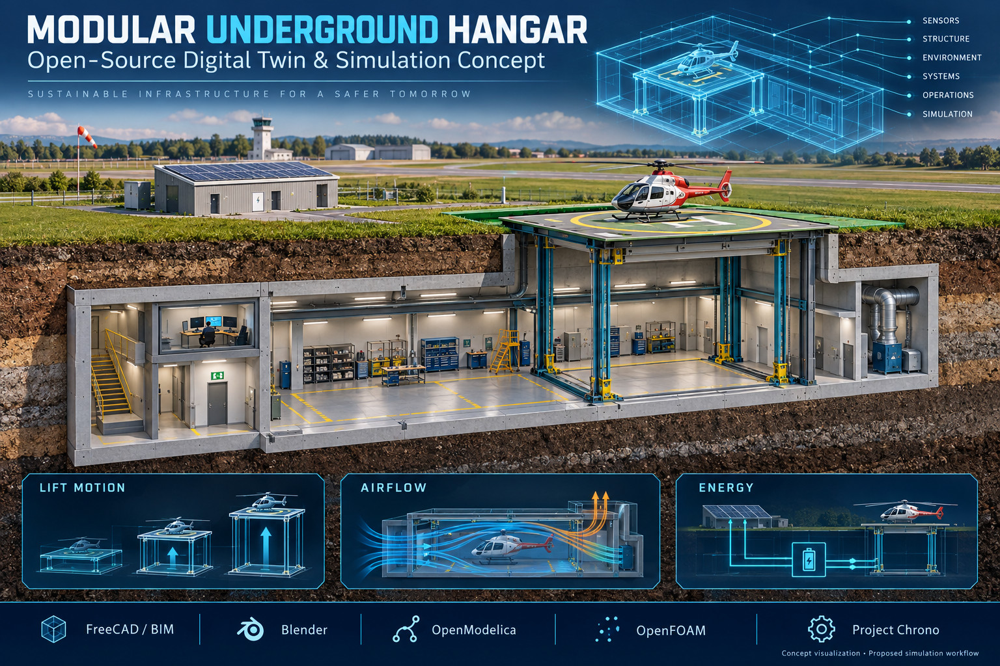
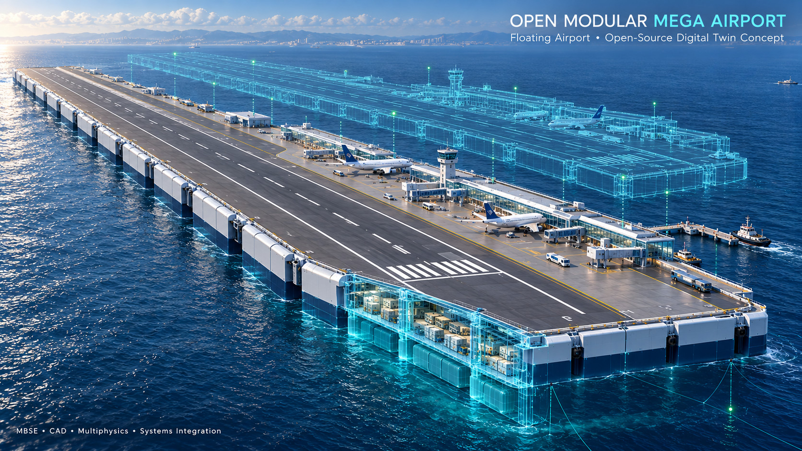
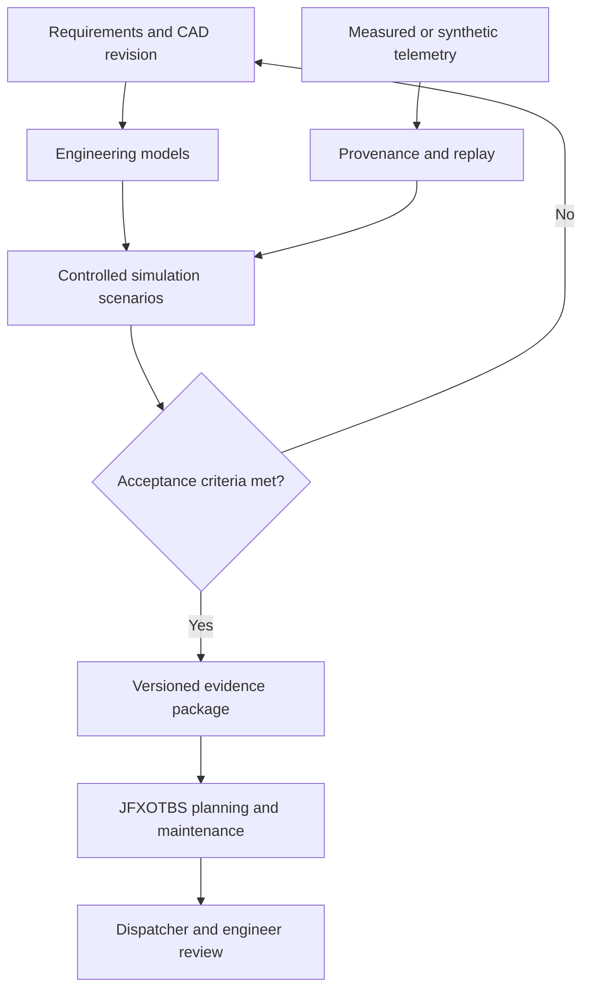

# OpenTwin AI Aviation Operations, Travel Management and Rescue Digital Twins

[](https://github.com/robotics-intelligent-systems/jfxotbs)
[](https://github.com/robotics-intelligent-systems/jfxotbs)
[](https://github.com/robotics-intelligent-systems/jfxotbs)
[](https://github.com/robotics-intelligent-systems/jfxotbs)
[](https://github.com/robotics-intelligent-systems/jfxotbs)

> **Open engineering reference architecture for AI-assisted airline operations, booking and travel management, extended with modular hydrogen rescue-aircraft, underground-hangar and floating-airport simulation concepts.**

**Implementation status:** This repository contains an architecture/software catalog and four CAD concept illustrations. Integrations and aircraft/facility capabilities described here are proposed, not a unified operational application or validated engineering design.

---

## Table of Contents

- [Documentation Index](docs/README.md)
- [Modular GCS Drone Trailer](docs/architecture/modular-gcs-drone-trailer.md)
- [Peru RPAS Pilot Accreditation](docs/training/peru-rpas-pilot-accreditation.md)
- [Description and Context](#description-and-context)
- [Vision](#vision)
- [Objectives](#objectives)
- [Functional Scope](#functional-scope)
- [Architecture](#architecture)
- [Airline Reservation System](#airline-reservation-system)
- [Passenger and Customer Management](#passenger-and-customer-management)
- [Revenue Management](#revenue-management)
- [Flight Operations](#flight-operations)
- [Crew Scheduling](#crew-scheduling)
- [Aircraft Maintenance](#aircraft-maintenance)
- [Predictive Maintenance](#predictive-maintenance)
- [Travel Market Simulation](#travel-market-simulation)
- [Airline Simulation](#airline-simulation)
- [Travel API Integration](#travel-api-integration)
- [ACARS Integration](#acars-integration)
- [Airport and Hangar Management](#airport-and-hangar-management)
- [Workflow and Transaction Management](#workflow-and-transaction-management)
- [AI Aviation Intelligence](#ai-aviation-intelligence)
- [Business Intelligence](#business-intelligence)
- [MBSE Integration](#mbse-integration)
- [CAD Concepts and Rescue Digital Twins](#cad-concepts-and-rescue-digital-twins)
- [H2-OpenTwin Pegasus VTOL Rescue](#h2-opentwin-pegasus-vtol-rescue)
- [Modular Underground Hangar](#modular-underground-hangar)
- [Open Modular Mega Floating Airport](#open-modular-mega-floating-airport)
- [FOSS Simulation and Digital-Twin Integration](#foss-simulation-and-digital-twin-integration)
- [Software Dependency Compendium](#software-dependency-compendium)
- [Aviation Technology Categories](#aviation-technology-categories)
- [Dependency Classification](#dependency-classification)
- [Technology Matrix](#technology-matrix)
- [Recommended Reference Architecture](#recommended-reference-architecture)
- [Data Architecture](#data-architecture)
- [AI Architecture](#ai-architecture)
- [User Guide](#user-guide)
- [Installation Guide](#installation-guide)
- [Dependencies](#dependencies)
- [Development Workflow](#development-workflow)
- [Testing and Validation](#testing-and-validation)
- [Security and Safety](#security-and-safety)
- [Responsible AI](#responsible-ai)
- [Repository Structure](#repository-structure)
- [CI/CD](#cicd)
- [Roadmap](#roadmap)
- [How to Contribute](#how-to-contribute)
- [Code of Conduct](#code-of-conduct)
- [Authors](#authors)
- [Additional Information](#additional-information)
- [License](#license)

---

# Description and Context

JFXOTBS is an open-source aviation technology and architecture project focused on the integration of **airline reservation, flight booking, airline operations, travel management, revenue management, aircraft maintenance, aviation simulation and Artificial Intelligence**.

The commercial scope covers a **Flight Book Management System / Airline Reservation System / Computer Reservation System (CRS)**. The engineering scope also connects **H2-OpenTwin Pegasus VTOL Rescue**, a **modular underground hangar** and an **open modular floating airport** to fleet readiness, rescue dispatch, facility scheduling and simulation.

The current technology ecosystem includes projects and reference implementations covering:

- Airline booking
- Computer Reservation Systems
- Revenue management
- Travel-market simulation
- Airline management
- Flight operations
- Aircraft maintenance
- Predictive maintenance
- Crew scheduling
- Travel APIs
- Airport and hangar management
- ACARS
- Airline simulation
- Resource scheduling
- ERP-based property management
- Workflow orchestration
- Aviation research

The repository also organizes engineering activities around:

```text
MBSE
├── CAD
├── CAM
└── CAS
```

with Arcadia/Capella as the reference systems-engineering approach. CAD represents computer-aided design, CAM manufacturing and assembly, and CAS simulation and end-to-end performance analysis.

---

# Vision

The long-term vision is to evolve JFXOTBS into an **AI-native aviation operations platform** capable of connecting the complete airline lifecycle:

```text
Passenger
    ↓
Search
    ↓
Booking
    ↓
Ticketing
    ↓
Revenue Management
    ↓
Flight Operations
    ↓
Crew Operations
    ↓
Aircraft Operations
    ↓
Maintenance
    ↓
Arrival
    ↓
Customer Experience
    ↓
Analytics
    ↓
Optimization
```

The platform should connect commercial, operational and engineering data into a common aviation intelligence layer.

---

# Objectives

## Primary Objectives

1. Provide an open-source airline reservation architecture.
2. Integrate AI into airline operations.
3. Support flight booking and ticket management.
4. Integrate revenue management.
5. Support airline operational management.
6. Support crew scheduling and optimization.
7. Integrate aircraft maintenance.
8. Enable predictive aircraft maintenance.
9. Integrate travel APIs.
10. Support ACARS and operational telemetry.
11. Support aviation simulation.
12. Provide aviation business intelligence.
13. Integrate MBSE/CAD/CAM/CAS engineering workflows.
14. Study modular LH2 rescue aircraft and mission payloads through versioned simulation models.
15. Connect hangar and floating-airport concepts to resource scheduling and engineering evidence.

## Secondary Objectives

- Improve airline operational efficiency.
- Optimize aircraft utilization.
- Improve crew allocation.
- Reduce maintenance downtime.
- Improve revenue forecasting.
- Support airline market simulation.
- Provide reusable aviation software components.
- Enable AI-assisted airline decision-making.
- Provide an open engineering reference architecture.

---

# Functional Scope

| Domain | Function |
|---|---|
| Reservation | Flight search and booking |
| CRS | Reservation and inventory |
| Ticketing | Passenger ticket management |
| Revenue Management | Pricing and demand optimization |
| Airline Operations | Flight and operational management |
| Crew | Scheduling and optimization |
| Aircraft | Fleet management |
| Maintenance | Maintenance planning and tracking |
| Predictive Maintenance | Failure prediction |
| Travel | Travel-market and API integration |
| ACARS | Aircraft communication |
| Airport | Hangar/resource management |
| Simulation | Airline and market simulation |
| Workflow | Transaction orchestration |
| AI | Prediction and intelligent automation |
| BI | Aviation analytics |
| MBSE | System architecture |
| CAD/CAM/CAS | Engineering lifecycle |
| Rescue missions | SAR, Medevac, coast-guard support and humanitarian configuration studies |
| Hydrogen aircraft | LH2 energy-system and candidate VTOL configuration studies |
| Infrastructure twins | Underground-hangar and floating-airport models |

---

# Architecture

The proposed platform connects commercial services and mission operations through shared fleet, resource and evidence services. Flight control remains outside the business platform.



See [CAD Concepts and Rescue Digital Twins](#cad-concepts-and-rescue-digital-twins) for aircraft and infrastructure interfaces.

---

# Airline Reservation System

The reservation layer is the central commercial component.

## Core Entities

```text
Passenger
    │
    ├── Customer Profile
    ├── Contact
    └── Loyalty Account
         │
         ▼
Reservation
    │
    ├── Flight
    ├── Segment
    ├── Seat
    ├── Fare
    ├── Ticket
    └── Ancillary Services
```

## Booking Lifecycle

```text
Search
  ↓
Availability
  ↓
Fare Selection
  ↓
Passenger Data
  ↓
Reservation
  ↓
Payment
  ↓
Ticket Issuance
  ↓
Confirmation
  ↓
Check-in
  ↓
Boarding
```

---

# Passenger and Customer Management

A unified passenger model should include:

```text
Passenger
├── Identity
├── Contact Information
├── Travel Preferences
├── Loyalty
├── Reservations
├── Tickets
├── Payments
├── Baggage
├── Assistance
├── Communications
└── Travel History
```

The AI layer can derive:

```text
Passenger Intelligence
├── Travel Preferences
├── Frequent Routes
├── Purchase Probability
├── Ancillary Preference
├── Churn Risk
├── Customer Value
└── Next Best Offer
```

Derived information should always be distinguished from factual customer data.

---

# Revenue Management

Revenue Management is a major component of the repository's aviation ecosystem.

The repository references a travel-market simulator focused on **revenue management for airlines**.

The conceptual model is:

```text
Historical Demand
       ↓
Market Data
       ↓
Forecasting
       ↓
Demand Model
       ↓
Capacity
       ↓
Pricing
       ↓
Booking
       ↓
Revenue
       ↓
Feedback
```

## Revenue Management Inputs

- Historical bookings
- Fare classes
- Seat inventory
- Competitor pricing
- Seasonal demand
- Route demand
- Passenger segments
- Cancellation behavior
- No-show probability
- Capacity
- Aircraft configuration

## Revenue Management Outputs

- Fare recommendations
- Inventory controls
- Demand forecasts
- Route profitability
- Revenue forecasts
- Capacity recommendations

---

# Flight Operations

AirOpsManager and Aviation Management System represent the operational-management dimension of the current technology catalog.

Potential operational entities include:

```text
Flight
├── Flight Number
├── Route
├── Aircraft
├── Crew
├── Departure
├── Arrival
├── Gate
├── Status
├── Weather
├── Delay
└── Operational Events
```

A flight operations workflow:

```text
Schedule
  ↓
Aircraft Assignment
  ↓
Crew Assignment
  ↓
Gate Assignment
  ↓
Dispatch
  ↓
Departure
  ↓
In-flight Operations
  ↓
Arrival
  ↓
Post-flight Analysis
```

---

# Crew Scheduling

The repository includes an airline crew scheduling system using **Google OR-Tools CP-SAT**.

The scheduling problem can be modeled as:

```text
Crew
+
Flights
+
Qualifications
+
Availability
+
Duty Time
+
Rest Requirements
+
Operational Constraints
        ↓
Constraint Solver
        ↓
Optimized Crew Schedule
```

Potential optimization objectives:

- Minimize cost.
- Minimize deadhead travel.
- Maximize crew utilization.
- Minimize schedule disruption.
- Respect qualifications.
- Respect duty limitations.
- Maintain reserve coverage.

---

# Aircraft Maintenance

The repository includes aircraft maintenance systems covering aircraft data, maintenance operations, engine monitoring and diagnostics.

A maintenance model can include:

```text
Aircraft
├── Airframe
├── Engines
├── Components
├── Flight Hours
├── Flight Cycles
├── Maintenance Events
├── Inspections
├── Defects
├── Repairs
├── Parts
└── Maintenance History
```

---

# Predictive Maintenance

The repository references **AeroCare** as a predictive-maintenance solution and an aircraft-maintenance system capable of real-time monitoring, diagnostics and automated corrective actions.

The target predictive-maintenance architecture is:

```text
Aircraft Sensors
       ↓
Telemetry
       ↓
Data Ingestion
       ↓
Signal Processing
       ↓
Feature Extraction
       ↓
ML Model
       ↓
Failure Probability
       ↓
Maintenance Recommendation
       ↓
Engineer Review
       ↓
Maintenance Action
```

Potential predictions:

- Component failure
- Engine anomaly
- Remaining useful life
- Maintenance urgency
- Abnormal operating condition

For safety-critical applications, AI predictions must remain advisory until validated through approved aviation engineering and safety processes.

---

# Travel Market Simulation

The repository includes a **Travel Market Simulator** focused on airline revenue-management research and a **Mercury** research-oriented air-transportation mobility simulator.

A market simulation architecture:

```text
Airlines
   │
   ├── Fleet
   ├── Routes
   ├── Prices
   ├── Capacity
   └── Schedules
         │
         ▼
   Travel Market
         │
   ┌─────┼─────┐
   ▼     ▼     ▼
Demand  Price  Competition
   │     │     │
   └─────┼─────┘
         ▼
      Revenue
         │
         ▼
   Airline Strategy
```

This enables experimentation with:

- Demand elasticity
- Competition
- Fare strategies
- Route networks
- Fleet allocation
- Revenue optimization

---

# Airline Simulation

Simulation should provide a safe environment for testing operational strategies before deployment.

```text
Simulation Scenario
        ↓
Aircraft
        ↓
Network
        ↓
Passengers
        ↓
Demand
        ↓
Flights
        ↓
Operations
        ↓
Disruptions
        ↓
AI Optimization
        ↓
Results
```

Possible scenarios:

- Flight delays
- Aircraft failures
- Crew shortages
- Demand spikes
- Weather disruption
- Airport congestion
- Fuel-price changes
- Route cancellations

---

# Travel API Integration

The repository includes a Java library for **Amadeus Self-Service travel APIs** and a **Sabre Java Bridge**.

The integration layer can expose:

```text
JFXOTBS
   │
   ├── Amadeus
   ├── Sabre
   ├── Airline APIs
   ├── Airport APIs
   └── Travel APIs
```

Potential services:

- Flight search
- Availability
- Fare search
- Booking
- Ticketing
- Airport information
- Hotel search
- Travel recommendations

External API credentials should never be committed to the repository.

---

# ACARS Integration

The repository includes:

- AeroACARS
- A PyQt6-based ACARS application
- ACARS integration with phpVMS
- Microsoft Flight Simulator-related ACARS tooling

ACARS can be represented as:

```text
Aircraft
   ↓
ACARS
   ↓
Communication Network
   ↓
Ground Station
   ↓
Operations Platform
   ↓
Flight / Maintenance Systems
```

Potential applications:

- Operational messages
- Aircraft status
- Maintenance information
- Flight events
- Position-related information
- Operational alerts

---

# Airport and Hangar Management

The repository includes an **Airplane Hangar Management System** for managing:

- Hangars
- Aircraft
- Reservations
- Reports

A generalized resource model:

```text
Airport
├── Terminal
├── Gate
├── Runway
├── Hangar
├── Stand
├── Resource
└── Operational Capacity
```

Resource scheduling can then optimize:

```text
Aircraft
+
Gate
+
Hangar
+
Crew
+
Maintenance Slot
+
Time
```

---

# Workflow and Transaction Management

The repository references a Saga-pattern implementation for the classic trip-booking example using **Camunda**.

A distributed booking workflow can be:

```text
Search
  ↓
Reserve Seat
  ↓
Reserve Ancillary
  ↓
Payment
  ↓
Issue Ticket
  ↓
Confirmation
```

If a transaction fails:

```text
Failure
  ↓
Compensation
  ↓
Release Seat
  ↓
Cancel Ancillary
  ↓
Refund / Reverse Payment
```

This is especially useful when a booking crosses multiple independent services.

---

# AI Aviation Intelligence

AI can operate across commercial, operational and engineering domains.

```text
                    AI AVIATION ENGINE
                           │
        ┌──────────────────┼──────────────────┐
        ▼                  ▼                  ▼
   Commercial AI      Operations AI     Engineering AI
        │                  │                  │
        ▼                  ▼                  ▼
 Revenue Forecast      Flight Ops      Maintenance AI
 Demand Prediction     Crew AI         Diagnostics
 Pricing AI            Disruption AI   RUL Prediction
 Customer AI            Scheduling      Engineering AI
```

---

# AI Agents

Potential aviation agents include:

| Agent | Function |
|---|---|
| Booking Agent | Search and reservation assistance |
| Travel Agent | Travel planning |
| Revenue Agent | Pricing analysis |
| Operations Agent | Flight operations |
| Crew Agent | Crew scheduling assistance |
| Maintenance Agent | Maintenance analysis |
| Fleet Agent | Fleet optimization |
| Airport Agent | Resource management |
| BI Agent | Aviation analytics |
| Customer Service Agent | Passenger assistance |

A human approval layer should remain between AI recommendations and safety-critical operational actions.

---

# Business Intelligence

JFXOTBS can incorporate an aviation Business Intelligence layer.

## Commercial KPIs

- Revenue
- Revenue per passenger
- Load factor
- Yield
- Average fare
- Booking conversion
- Ancillary revenue
- Route profitability

## Operational KPIs

- On-time performance
- Flight delays
- Cancellation rate
- Aircraft utilization
- Crew utilization
- Airport turnaround time

## Maintenance KPIs

- Mean Time Between Failures
- Mean Time To Repair
- Aircraft availability
- Maintenance cost
- Deferred defects
- Component failure rate

## Customer KPIs

- Passenger satisfaction
- Repeat travel
- Customer lifetime value
- Complaint rate
- Loyalty activity

---

# MBSE Integration

The project uses an engineering organization based on MBSE with Arcadia/Capella as a reference methodology.

The architecture can follow:

```text
Operational Analysis
        ↓
System Analysis
        ↓
Logical Architecture
        ↓
Physical Architecture
        ↓
Component Architecture
        ↓
Implementation
        ↓
Verification
```

The engineering structure is:

```text
MBSE
├── CAD
├── CAM
└── CAS
```

## CAD

Aircraft, component and infrastructure concept design. The current [CAD assets](MBSE/CAD/) are JPG illustrations; editable geometry and analysis models remain roadmap deliverables.

## CAM

Manufacturing and assembly.

## CAS

Simulation, analysis and performance validation.

---

# CAD Concepts and Rescue Digital Twins

The [CAD directory](MBSE/CAD/) contains four concept illustrations, with the GCS trailer added to this catalog on 7 October 2026. These extend airline operations with aircraft, maintenance-base, offshore-airport and mobile ground-station studies. They are raster illustrations, not editable CAD assemblies, validated simulation models or approved facilities.

| Concept | Repository asset | Proposed platform connection |
|---|---|---|
| H2-OpenTwin Pegasus VTOL Rescue | [Aircraft cutaway](MBSE/CAD/OpenTwin_VTOL_Rescue_LH2_Cutaway_Concept_v1.jpg) | SAR dispatch, mission configuration, energy planning, crew readiness and maintenance |
| Modular Underground Hangar | [Hangar digital twin](MBSE/CAD/modular-underground-hangar-digital-twin.jpg) | Lift-platform scheduling, storage, maintenance bays and facility monitoring |
| Open Modular Mega Floating Airport | [Floating-airport concept](MBSE/CAD/open-modular-mega-floating-airport.jpg) | Offshore airport resources, turnaround, maritime access and disruption simulation |
| Modular GCS Drone Trailer | [Physical/virtual simulation concept](MBSE/CAD/jfxotbs-modular-gcs-trailer-digital-twin-simulation-concept-v1.jpg) | Equipment readiness, communications and energy monitoring, maintenance and scenario comparison |

The [GCS architecture note](docs/architecture/modular-gcs-drone-trailer.md) structures the additional English source, preserves its unverified capability claims and connects the illustration to four proposed simulation scenarios. See the [documentation index](docs/README.md) and [migration register](docs/MIGRATION-REGISTER.md) for provenance.

## H2-OpenTwin Pegasus VTOL Rescue

**Modular Hydrogen VTOL Search & Rescue Platform**

The proposed concept combines the Pegasus VBJ-01-inspired rescue airframe with the modular H2-OpenTwin Air LH2 architecture. Intended missions include search and rescue (SAR), medical evacuation (Medevac), coast-guard support and humanitarian logistics. Extended endurance is a design objective requiring a mission energy budget; no range, endurance or payload capability is established by the illustration.



**Image interpretation:** the top-view inset identifies four lift fans, while another label says “rear cruise propulsion fans (4x).” This documentation adopts **four wing-integrated lift fans plus one aft electric cruise propulsor** as the candidate configuration for study. The raster image is unchanged. Its “zero emissions,” “no patent lock-in” and centralized-CG labels are not verified environmental, intellectual-property or engineering findings.

### Candidate VTOL configuration

Use one parametric airframe for every view: a broad integrated wing–fuselage layout, four embedded lift-fan ducts in mirrored left/right positions, one aft cruise unit and consistent tail geometry.

| View | Requirement for the next CAD revision |
|---|---|
| Top | Show four embedded ducts within the intended wing/body surfaces. Preserve fuselage width, planform and bilateral symmetry; avoid a radial multicopter arrangement. |
| Front | Preserve span, fuselage section and duct positions. Use cutaway or hidden-line annotations for obscured ducts rather than forcing four visible fan circles into the projection. |
| Side | Retain cabin, tail and aft propulsion station. Identify embedded ducts with section annotations where needed; distinguish lift and cruise modes without changing the airframe. |
| Cutaway and mesh | Reuse component IDs, coordinate frames and geometry; keep tank, rescue-bay and propulsion positions consistent. |

The four-fan option is a **trade-study baseline**, not a proven optimum. Compare it with eight lift units using installed mass, power/thrust needs, duct losses, structural integration, acoustics, maintenance and controllability after failures. Fewer units do not by themselves establish lower system mass or sufficient redundancy.

Central LH2 storage is a packaging proposal. Verify the center-of-gravity envelope across fuel depletion, crew positions and mission modules; do not assume the CG coincides with the tank center.

For the fuel-cell-electric baseline, the aft unit is an **electric fan or propeller**. A hydrogen-burning cruise turbine would be a separate variant requiring its own fuel, mass, thermal and emissions models.

### Internal architecture and interfaces

| Module | Proposed content | Required analysis or interface |
|---|---|---|
| Sensor suite | Candidate AESA radar, EO/IR, LiDAR, ADS-B, weather sensors and maritime AIS where relevant | Coverage, data quality, timestamps, electrical loads and installation constraints |
| Mission cockpit | Pilot/co-pilot stations, fly-by-wire interfaces, mission console and twin display | Separate flight-control authority from mission computing and advisory AI |
| Interchangeable rescue bay | Medical, extraction, optional SAR-drone or humanitarian equipment | Module identity, mass properties, mounting, access and electrical/data services |
| Cryogenic LH2 storage | Conceptual vacuum-insulated tanks, monitoring and protective functions | Fuel conditioning, heat ingress, usable fuel and safety interfaces |
| Energy conversion | Fuel-cell stack, buffer battery, power electronics and thermal management | Conditioned hydrogen supply, transients, losses, cooling and reserves |
| Distributed propulsion | Four lift fans and one aft electric cruise unit | Lift, transition and cruise models with actuator and power limits |

Fuel cells are supplied through hydrogen conditioning; they are not modeled as directly consuming cryogenic liquid. The diagram describes functional energy/information relationships, not compartment order or detailed plumbing.



### Interchangeable mission modules

| Module | Candidate equipment | Configuration boundary |
|---|---|---|
| Medevac | Two to four stretchers as a **layout target**, oxygen, patient monitoring and life support | Verify occupied mass, restraint, access, evacuation, power and medical installation before assigning capacity. |
| Search and rescue | Optional VTOL SAR drones, EO/IR, night lighting and extraction equipment | Model drone deployment and rescue procedures separately, including operating limits. |
| Coast-guard support | Inflatable rafts, maritime rescue equipment, satellite communications and optional deployable sonar | Define deployment and water-coupling arrangements; generic airborne sensors do not replace underwater equipment. |
| Humanitarian aid | Medicines, water, food and portable energy | Track restraint, mass/CG, storage conditions and unloading requirements. |

**Drawing vocabulary:** OPEN AVIONICS RESEARCH; DIGITAL TWIN INTERFACE; ROS 2 MISSION COMPUTER; DISTRIBUTED ELECTRIC LIFT FANS; MODULAR RESCUE BAY; CRYOGENIC LH2 STORAGE; FUEL-CELL POWER SYSTEM; BUFFER BATTERY; AFT ELECTRIC CRUISE PROPULSOR; MEDICAL EVACUATION MODULE; OPTIONAL SAR DRONES; OPENMODELICA INTEGRATION.

“Open flight stack” is an implementation direction to evaluate, not an existing certified solution for this crewed aircraft. ROS 2 mission integration and experimental autonomy remain distinct from flight control.

## Modular Underground Hangar



The concept places maintenance and storage bays below a surface landing/lift platform, with a control room, access routes, ventilation and an energy subsystem. Its proposed twin combines structural geometry, lift motion, airflow, energy and maintenance operations.

JFXOTBS would represent the platform, bays and equipment as reservable assets with capacity and availability states. Study aircraft clearances, lift loads/interlocks, maintenance access, ventilation, drainage, evacuation and power interruption before treating a layout as usable infrastructure. Suitability for LH2 aircraft and hydrogen servicing requires a separate facility assessment.

## Open Modular Mega Floating Airport



The concept combines floating structural modules, runway/taxiway surfaces, terminal and apron areas, utilities and maritime access. It is a planning reference for an airport–marine digital twin, not evidence of runway capacity or all-weather operability.

JFXOTBS would link stand/gate scheduling, turnaround, maritime logistics and maintenance availability to simulated environmental constraints. Studies should address wave-induced motion, mooring and module interfaces, structural loads, utility continuity, emergency access and weather-dependent operating windows. Quantitative limits require site-specific models and engineering review.

## FOSS Simulation and Digital-Twin Integration

These are **candidate components**, not installed dependencies or tested integrations. Linked upstream projects provide software references; the assignment of work to each tool is a proposed JFXOTBS design choice.

| Layer | Candidate | Proposed evidence output |
|---|---|---|
| Parametric geometry | [FreeCAD](https://github.com/FreeCAD/FreeCAD) | Versioned aircraft/facility geometry, clearances and consistent drawing views |
| Visualization | Blender | Cutaways and visual assets derived from the approved geometry |
| Energy and systems | [OpenModelica](https://openmodelica.org/) | Candidate conditioning, fuel-cell, battery and thermal models; evaluate library suitability |
| Fluid analysis | [OpenFOAM](https://openfoam.org/) | Aircraft/duct flow, hangar ventilation and platform-fluid studies with separately validated setups |
| Structures | [CalculiX](https://www.dhondt.de/) | Airframe, tank-support, lift and platform load cases |
| Flight dynamics | [JSBSim](https://jsbsim-team.github.io/jsbsim/) | Aircraft-specific dynamics; transition and fan interactions require validated additional modeling |
| Mechanisms | [Project Chrono](https://projectchrono.org/) | Hangar-lift and mechanical-system simulation |
| Mission and sensors | [ROS 2](https://github.com/ros2/ros2), [Gazebo](https://gazebosim.org/) | Simulated streams, mission orchestration and replay through defined adapters |
| Interactive twin | [Godot via gdext](https://godot-rust.github.io/) | Rust/GDExtension operator views; engineering models determine physics fidelity |

Define units, coordinate frames, timestamps, exchange rates, latency behavior, model versions and failure handling for every integration. Shared geometry alone is not a synchronized digital twin. Until measurement-based calibration and traceable validation exist, outputs remain concept-model or simulation results.



### Operational interfaces

| Domain | Proposed extension |
|---|---|
| Fleet | Aircraft configuration, installed mission module and readiness |
| Operations | SAR/Medevac task, dispatch plan, crew qualifications and resource conflicts |
| Maintenance | Component history, inspection requirements and reviewed anomalies |
| Airport and hangar | Lift/bay/stand reservations, turnaround and environmental restrictions |
| Data platform | Configuration IDs, scenario IDs, time-series evidence and provenance |
| AI and BI | Advisory scenario comparison, readiness summaries and maintenance triage |

SAR tasking is an operational workflow, not a passenger fare or demand-pricing decision. Restrict patient-data access and use synthetic records in demonstrations. AI agents may prepare options but cannot directly command aircraft, release maintenance or authorize dispatch.

### Verification roadmap

1. Establish editable CAD and consistent views; resolve the propulsion-label discrepancy.
2. Compare four versus eight lift units, cabin layouts, tank packaging and mass/CG envelopes.
3. Model lift/transition/cruise energy, thermal loads, usable fuel and mission reserves.
4. Evaluate hangar lift/clearances and floating-airport structural/environmental constraints independently.
5. Test adapters, time synchronization, degraded sensors, power limitations and aborted missions in reproducible simulations.
6. Compare outputs with appropriate test data and engineering acceptance criteria before making performance or operational claims.

This catalog establishes no implemented adapters, certified avionics, approved medical capacity, guaranteed endurance or patent clearance.

---

# Software Dependency Compendium

> **Important:** The following compendium represents the technology ecosystem currently documented by JFXOTBS. It is not a claim that every listed project is a direct runtime dependency of the repository.

---

## 1. Airline Reservation Systems

| Technology | Purpose | Classification |
|---|---|---|
| Flight Book Management System | Airline reservation | Core Candidate |
| Airline Reservation System / CRS | Reservation architecture | Core |
| Airplane Ticket Booking and Management System | Flight ticket management | Core Candidate |
| Virtual Airlines Manager (VAM) | Virtual airline management | Reference |
| phpVMS | Virtual airline platform | Optional |
| LibreBooking | Resource scheduling | Optional |

---

## 2. Airline Operations

| Technology | Purpose | Classification |
|---|---|---|
| AirOpsManager | Airline operations | Core Candidate |
| Aviation Management System | Aviation operations and aircraft data | Core Candidate |
| Virtual Airlines Manager | Airline administration | Reference |
| Flight Operations Platforms | Operational management | Integration |

---

## 3. Revenue Management

| Technology | Purpose | Classification |
|---|---|---|
| Travel Market Simulator | Airline revenue-management simulation | Research |
| Mercury | Air-transportation mobility simulation | Research |
| Revenue Management Models | Demand/pricing optimization | Core Candidate |
| Market Simulation | Competitive airline analysis | Research |

---

## 4. Crew Scheduling

| Technology | Purpose | Classification |
|---|---|---|
| Google OR-Tools | Constraint optimization | Core Candidate |
| CP-SAT | Crew scheduling | Core Candidate |
| Airline Crew Scheduling System | Crew planning | Core Candidate |
| Constraint Programming | Operational optimization | Core |

---

## 5. Aircraft Maintenance

| Technology | Purpose | Classification |
|---|---|---|
| Aircraft Maintenance System | Maintenance management | Core Candidate |
| AeroCare | Predictive maintenance | Research/Core Candidate |
| Aircraft Engine Monitoring | Engine diagnostics | Integration |
| Predictive Maintenance ML | Failure prediction | Research |
| Maintenance Management Systems | MRO workflows | Integration |

---

## 6. Travel APIs

| Technology | Purpose | Classification |
|---|---|---|
| Amadeus Self-Service APIs | Travel API access | Integration |
| Amadeus Java Library | Java API integration | Integration |
| Sabre Java Bridge | Sabre integration | Integration |
| Airline APIs | Airline inventory | Integration |
| Airport APIs | Airport information | Integration |

---

## 7. Travel and Hospitality

| Technology | Purpose | Classification |
|---|---|---|
| ExcursioX | Travel management | Reference |
| ERPNext Property Management | Property management | Optional |
| LibreBooking | Resource reservation | Optional |
| Travel Booking Systems | Travel management | Integration |

---

## 8. Workflow and Distributed Transactions

| Technology | Purpose | Classification |
|---|---|---|
| Camunda | Workflow orchestration | Core Candidate |
| Saga Pattern | Distributed transaction management | Core |
| BPMN | Business process modeling | Core |
| Event-driven workflows | Operational orchestration | Core |

---

## 9. ACARS

| Technology | Purpose | Classification |
|---|---|---|
| AeroACARS | ACARS client | Integration |
| phpVMS ACARS | Airline simulation integration | Reference |
| PyQt6 ACARS | Desktop ACARS application | Reference |
| Microsoft Flight Simulator ACARS | Simulation communication | Reference |

---

## 10. Airline Simulation

| Technology | Purpose | Classification |
|---|---|---|
| Mercury | Air-transport mobility simulation | Research |
| Travel Market Simulator | Market/revenue simulation | Research |
| phpVMS | Airline simulation | Reference |
| Virtual Airlines Manager | Virtual airline simulation | Reference |

---

## 11. AI / Machine Learning

Recommended AI technologies:

| Technology | Purpose | Classification |
|---|---|---|
| Large Language Models | Aviation assistant | Core |
| RAG | Aviation knowledge retrieval | Core |
| Embedding Models | Semantic aviation search | Core |
| ML Forecasting | Demand prediction | Core |
| Anomaly Detection | Aircraft/operation monitoring | Core |
| Predictive Maintenance | Failure prediction | Research |
| Optimization AI | Operations optimization | Research |
| AI Agents | Aviation workflow automation | Research/Core Candidate |

---

## 12. Data Platform

Recommended components:

| Technology | Purpose | Classification |
|---|---|---|
| PostgreSQL | Operational data | Core |
| Redis | Caching/session management | Optional |
| Qdrant | Vector search | Optional |
| OpenSearch | Search and analytics | Optional |
| DuckDB | Local analytical processing | Optional |
| MinIO | Object storage | Optional |

---

## 13. Engineering

| Technology | Purpose | Classification |
|---|---|---|
| Arcadia | Systems engineering method | Core Reference |
| Capella | MBSE modeling | Core Candidate |
| CAD | Aircraft/component design | Engineering |
| CAM | Manufacturing/assembly | Engineering |
| CAS | Simulation/analysis | Engineering |
| FOSS rescue and infrastructure stack | See the [candidate tool matrix](#foss-simulation-and-digital-twin-integration) | Research / Engineering |

---

# Aviation Technology Categories

The overall technology ecosystem can be organized as:

```text
                         JFXOTBS
                            │
       ┌────────────────────┼────────────────────┐
       ▼                    ▼                    ▼
  COMMERCIAL             OPERATIONS          ENGINEERING
       │                    │                    │
       ├── CRS              ├── Flight Ops       ├── MBSE
       ├── Booking          ├── Crew             ├── CAD
       ├── Ticketing        ├── Fleet            ├── CAM
       ├── Revenue          ├── Airport          └── CAS
       └── Travel           └── Maintenance
                                │
                                ▼
                               AI
                                │
              ┌─────────────────┼─────────────────┐
              ▼                 ▼                 ▼
          Prediction        Optimization       Agents
              │                 │                 │
              └─────────────────┼─────────────────┘
                                ▼
                               BI
                                │
                                ▼
                         Decision Support
```

---

# Dependency Classification

| Classification | Definition |
|---|---|
| Core | Fundamental project capability |
| Core Candidate | Candidate primary implementation |
| Runtime | Required during execution |
| Build | Required for compilation |
| Development | Developer tooling |
| Test | Testing infrastructure |
| Integration | External service/API |
| Optional | Optional capability |
| Research | Experimental/research technology |
| Reference | Reference implementation |
| Engineering | Engineering-domain technology |
| Legacy | Historical compatibility |
| Deprecated | No longer recommended |

---

# Technology Matrix

| Layer | Recommended Technology |
|---|---|
| CRS | Airline Reservation System |
| Booking | Flight Booking Platform |
| Travel | Amadeus / Sabre APIs |
| Revenue | Revenue Management Engine |
| Optimization | OR-Tools CP-SAT |
| Workflow | Camunda / BPMN |
| Crew | Constraint Solver |
| Maintenance | MRO System |
| Predictive Maintenance | ML / Anomaly Detection |
| ACARS | AeroACARS-compatible integration |
| Simulation | Mercury / Travel Market Simulator |
| AI | LLM + ML |
| Agents | AI Agent Framework |
| Database | PostgreSQL |
| Search | OpenSearch |
| Vector Search | Qdrant |
| BI | Superset / Metabase / Grafana |
| MBSE | Capella / Arcadia |
| Containers | Docker |
| Orchestration | Kubernetes |
| CI/CD | GitHub Actions |

---

# Recommended Reference Architecture

```text
                         PASSENGER
                             │
                             ▼
                      Booking Interface
                             │
                             ▼
                       API Gateway
                             │
              ┌──────────────┼──────────────┐
              ▼              ▼              ▼
             CRS          Revenue          Travel
              │           Management         APIs
              │              │                │
              └──────────────┼────────────────┘
                             ▼
                       Airline Core
                             │
       ┌─────────────────────┼──────────────────────┐
       ▼                     ▼                      ▼
    Flight Ops             Crew                 Fleet
       │                     │                      │
       └─────────────────────┼──────────────────────┘
                             ▼
                        Maintenance
                             │
                             ▼
                         Telemetry
                             │
                             ▼
                       AI / ML Layer
                             │
              ┌──────────────┼──────────────┐
              ▼              ▼              ▼
          Prediction     Optimization      Agents
              │              │              │
              └──────────────┼──────────────┘
                             ▼
                       Data Platform
                             │
              ┌──────────────┼──────────────┐
              ▼              ▼              ▼
             BI          Simulation        MBSE
                             │
                             ▼
                       Decision Support
```

---

# Data Architecture

The core aviation data model can be represented as:

```text
Airline
│
├── Airport
│   ├── Terminal
│   ├── Gate
│   ├── Runway
│   └── Hangar
│
├── Aircraft
│   ├── Type
│   ├── Engine
│   ├── Component
│   └── Maintenance
│
├── Flight
│   ├── Route
│   ├── Schedule
│   ├── Crew
│   ├── Aircraft
│   └── Operations
│
├── Passenger
│   ├── Reservation
│   ├── Ticket
│   ├── Payment
│   └── Loyalty
│
├── Fare
│   ├── Fare Class
│   ├── Price
│   └── Inventory
│
└── Maintenance
    ├── Inspection
    ├── Defect
    ├── Repair
    ├── Part
    └── Maintenance Event
```

---

# AI Architecture

```text
                       AVIATION DATA
                            │
                            ▼
                      Data Platform
                            │
            ┌───────────────┼───────────────┐
            ▼               ▼               ▼
        Historical      Real-time        External
           Data           Data             Data
            │               │               │
            └───────────────┼───────────────┘
                            ▼
                       AI Gateway
                            │
        ┌───────────────────┼──────────────────┐
        ▼                   ▼                  ▼
       LLM                  ML              Optimizer
        │                   │                  │
        └───────────────────┼──────────────────┘
                            ▼
                       AI Agents
                            │
       ┌────────────────────┼────────────────────┐
       ▼                    ▼                    ▼
   Booking Agent       Operations Agent    Maintenance Agent
       │                    │                    │
       └────────────────────┼────────────────────┘
                            ▼
                      Human Approval
                            │
                            ▼
                     Business Action
```

---

# User Guide

## Flight Booking Workflow

```text
1. Search flight
2. Select itinerary
3. Select fare
4. Enter passenger information
5. Create reservation
6. Process payment
7. Issue ticket
8. Send confirmation
```

---

## Airline Operations Workflow

```text
1. Create flight schedule
2. Assign aircraft
3. Assign crew
4. Assign airport resources
5. Dispatch flight
6. Monitor operation
7. Record events
8. Complete flight
9. Analyze performance
```

---

## Maintenance Workflow

```text
Aircraft
   ↓
Telemetry
   ↓
Condition Monitoring
   ↓
Anomaly Detection
   ↓
Maintenance Recommendation
   ↓
Engineer Review
   ↓
Maintenance Work Order
   ↓
Repair
   ↓
Return to Service
```

---

# AI Assistant Examples

Potential natural-language commands include:

```text
"Show flights with the highest expected demand."

"Which routes are underperforming?"

"Recommend aircraft for tomorrow's schedule."

"Which aircraft require maintenance soon?"

"Optimize crew assignments for this schedule."

"Estimate passenger demand for this route."

"Summarize today's operational disruptions."

"Which flights have the highest delay risk?"

"Compare the profitability of these routes."

"Simulate a 15% increase in demand."
```

AI-generated recommendations should provide evidence, confidence and provenance where possible.

---

# Installation Guide

> **Important:** The current JFXOTBS repository is primarily a technology and architecture catalog. It does not currently expose one unified executable application with a single dependency manifest. Installation instructions therefore describe the recommended development environment rather than claiming that all catalogued technologies must be installed.

## System Requirements

Recommended:

- Linux, macOS or Windows
- Git
- Docker
- Docker Compose
- Python 3.11+
- Node.js LTS
- Java 17+
- PostgreSQL
- Optional Kubernetes
- Optional GPU for local AI workloads

For optimization modules:

- Google OR-Tools

For aviation simulation modules:

- C++
- Python
- Appropriate simulator-specific dependencies

For Java API integrations:

- Java JDK
- Maven or Gradle

---

# Clone Repository

```bash
git clone https://github.com/robotics-intelligent-systems/jfxotbs.git
cd jfxotbs
```

---

# Inspect Repository

```bash
find . -maxdepth 3 -type f | sort
```

Inspect engineering structure:

```bash
find MBSE -type f | sort
```

---

# Python Environment

```bash
python3 -m venv .venv
source .venv/bin/activate
```

Install dependencies only when a module-specific manifest is available:

```bash
pip install -r requirements.txt
```

---

# Java Environment

```bash
java -version
```

For Maven-based modules:

```bash
mvn test
mvn package
```

For Gradle-based modules:

```bash
./gradlew test
./gradlew build
```

---

# Node.js Environment

For web modules:

```bash
npm install
npm test
npm run build
```

---

# Docker

Build a module-specific image:

```bash
docker build -t jfxotbs .
```

Run:

```bash
docker run --rm -p 8080:8080 jfxotbs
```

The actual port should be defined by the executable module.

---

# Dependencies

The dependency registry should document:

```yaml
dependency:
  name: example-component
  version: "x.y.z"
  category: "Core Candidate"
  purpose: "Aviation capability"
  license: "SPDX-License-Identifier"
  source: "https://github.com/example/project"
  runtime: true
  build: false
  tested: false
```

Every dependency should record:

- Name
- Version
- Purpose
- License
- Source
- Category
- Runtime requirement
- Build requirement
- Configuration
- Security status
- Compatibility
- Test status

---

# Development Workflow

The recommended development lifecycle is:

```text
Aviation Requirement
        ↓
Operational Use Case
        ↓
System Architecture
        ↓
Data Model
        ↓
Implementation
        ↓
Integration
        ↓
Simulation
        ↓
AI Optimization
        ↓
Verification
        ↓
Operational Validation
        ↓
Deployment
```

For safety-related functions, additional aviation certification and regulatory processes may be required.

---

# Testing and Validation

Testing should operate at multiple levels.

## Unit Testing

Test individual components:

```text
Booking
Pricing
Crew
Maintenance
Flight
Passenger
```

## Integration Testing

Test:

```text
CRS ↔ Travel APIs
CRS ↔ Payment
Booking ↔ Ticketing
Flight Ops ↔ Crew
Flight Ops ↔ Fleet
Fleet ↔ Maintenance
Maintenance ↔ AI
```

## Simulation Testing

Run controlled scenarios:

```text
Normal Operation
        +
Disruption Scenario
        +
AI Recommendation
        ↓
Simulation
        ↓
Expected Result
```

## Optimization Testing

Validate:

- Constraint satisfaction
- Objective function
- Feasibility
- Runtime
- Stability
- Reproducibility

---

# Security and Safety

Aviation systems can contain operationally sensitive information and, depending on deployment, safety-relevant functions.

Recommended security controls:

- OAuth2
- OpenID Connect
- Role-Based Access Control
- Encryption in transit
- Encryption at rest
- API authentication
- Secrets management
- Audit logging
- Network segmentation
- Dependency scanning
- Container scanning
- Secure configuration
- Backup and disaster recovery

---

# Aviation Safety Principle

AI must not be assumed to replace certified aviation systems or qualified engineering personnel.

Recommended architecture:

```text
AI Recommendation
       ↓
Evidence
       ↓
Confidence
       ↓
Engineering / Operations Review
       ↓
Approved Decision
       ↓
Operational System
```

For safety-critical applications, deterministic and certified processes should remain authoritative.

---

# Responsible AI

AI systems should clearly distinguish:

```text
OBSERVATION
    ↓
PREDICTION
    ↓
RECOMMENDATION
    ↓
DECISION
```

The AI system should not silently convert a prediction into an operational command.

Recommended AI controls:

- Human-in-the-loop
- Model versioning
- Data provenance
- Explainability
- Confidence scores
- Bias evaluation
- Drift detection
- Prompt-injection protection
- Access control
- Auditability

---

# Repository Structure

Current assets are described in the [CAD catalog](#cad-concepts-and-rescue-digital-twins). The existing [documentation index](docs/README.md) lists migrated source notes and their provenance. The following is a **proposed target structure**, not a list of implemented modules:

```text
jfxotbs/
│
├── README.md
│
├── MBSE/
│   ├── CAD/                     # Existing concept illustrations
│   └── CAS/
│       └── Drawio/              # Proposed simulation diagrams
│
├── docs/
│   ├── architecture/
│   ├── aviation/
│   ├── reservation/
│   ├── revenue-management/
│   ├── flight-operations/
│   ├── crew/
│   ├── maintenance/
│   ├── predictive-maintenance/
│   ├── travel/
│   ├── acars/
│   ├── simulation/
│   ├── business-intelligence/
│   ├── ai/
│   ├── mbse/
│   └── dependencies/
│       └── software-compendium.md
│
├── specs/
│   ├── reservation/
│   ├── operations/
│   ├── maintenance/
│   ├── simulation/
│   └── integrations/
│
├── src/
│   ├── booking/
│   ├── reservation/
│   ├── revenue/
│   ├── operations/
│   ├── crew/
│   ├── fleet/
│   ├── maintenance/
│   ├── travel/
│   ├── acars/
│   ├── ai/
│   └── analytics/
│
├── models/
│   ├── aviation/
│   ├── simulation/
│   ├── predictive-maintenance/
│   └── mbse/
│
├── tests/
│   ├── unit/
│   ├── integration/
│   ├── simulation/
│   ├── optimization/
│   └── ai/
│
├── examples/
│   ├── booking/
│   ├── airline-operations/
│   ├── crew-scheduling/
│   ├── maintenance/
│   └── revenue-management/
│
├── docker/
│
└── .github/
    └── workflows/
```

---

# CI/CD

Recommended pipeline:

```text
Commit
  ↓
Lint
  ↓
Static Analysis
  ↓
Unit Tests
  ↓
Integration Tests
  ↓
Optimization Tests
  ↓
Simulation Tests
  ↓
AI Evaluation
  ↓
Security Scan
  ↓
Container Build
  ↓
Container Scan
  ↓
Release
```

Recommended tools:

- GitHub Actions
- CodeQL
- Dependabot
- SonarQube / SonarCloud
- Trivy
- pytest
- JUnit
- Maven
- Gradle
- Docker
- Kubernetes

---

# Roadmap

## Phase 1 — Aviation Technology Catalog

- [x] Airline reservation ecosystem
- [x] Airline management ecosystem
- [x] Revenue-management ecosystem
- [x] Crew scheduling ecosystem
- [x] Maintenance ecosystem
- [x] ACARS ecosystem
- [x] Travel API ecosystem
- [x] Aviation simulation ecosystem
- [x] MBSE structure

## Phase 2 — Unified Aviation Data Model

- [ ] Passenger model
- [ ] Flight model
- [ ] Aircraft model
- [ ] Airport model
- [ ] Crew model
- [ ] Maintenance model
- [ ] Reservation model
- [ ] Revenue model

## Phase 3 — Airline Reservation Platform

- [ ] Flight search
- [ ] Availability
- [ ] Fare management
- [ ] Booking
- [ ] Ticketing
- [ ] Payment integration
- [ ] Check-in

## Phase 4 — Operations Platform

- [ ] Flight operations
- [ ] Fleet management
- [ ] Crew scheduling
- [ ] Airport resources
- [ ] Disruption management

## Phase 5 — AI Aviation Platform

- [ ] AI aviation assistant
- [ ] Revenue forecasting
- [ ] Demand prediction
- [ ] Crew optimization
- [ ] Predictive maintenance
- [ ] Operational anomaly detection
- [ ] AI agents

## Phase 6 — Simulation

- [ ] Airline market simulator
- [ ] Revenue simulation
- [ ] Network simulation
- [ ] Disruption simulation
- [ ] Digital twin
- [ ] Pegasus four-lift-fan and aft-electric-propulsor geometry baseline
- [ ] LH2 energy, payload and VTOL configuration trade studies
- [ ] Underground-hangar and floating-airport simulation models
- [ ] Mission/facility adapters with versioned validation evidence

## Phase 7 — Enterprise Aviation Platform

- [ ] Multi-tenancy
- [ ] Enterprise identity
- [ ] Audit platform
- [ ] Observability
- [ ] Kubernetes
- [ ] Data warehouse
- [ ] Advanced BI

---

# How to Contribute

Contributions are welcome.

Recommended workflow:

1. Fork the repository.
2. Create a feature branch.
3. Define the aviation use case.
4. Document the architecture.
5. Implement the capability.
6. Add tests.
7. Update the dependency compendium.
8. Update documentation.
9. Submit a pull request.

Example:

```bash
git checkout -b feature/revenue-management
```

```bash
git add .
git commit -m "feat: add airline revenue management architecture"
```

```bash
git push origin feature/revenue-management
```

---

# Code of Conduct

Contributors should:

- Respect other contributors.
- Provide constructive technical feedback.
- Protect operational and customer information.
- Respect aviation safety considerations.
- Document engineering decisions.
- Follow third-party licenses.
- Follow secure-development practices.

A dedicated `CODE_OF_CONDUCT.md` should be maintained at repository root.

---

# Authors

**Robotics Intelligent Systems**

Repository:

https://github.com/robotics-intelligent-systems/jfxotbs

Organization:

https://github.com/robotics-intelligent-systems

---

# Additional Information

## Aviation Ecosystem

The current repository represents a broad aviation technology ecosystem rather than one monolithic application.

The major domains are:

```text
                  JFXOTBS
                     │
        ┌────────────┼────────────┐
        ▼            ▼            ▼
   COMMERCIAL    OPERATIONS    ENGINEERING
        │            │            │
       CRS        Flight Ops      MBSE
     Booking        Crew          CAD
    Ticketing       Fleet         CAM
    Revenue       Maintenance     CAS
        │            │            │
        └────────────┼────────────┘
                     ▼
                    AI
                     │
          ┌──────────┼──────────┐
          ▼          ▼          ▼
       Forecast   Optimize   Diagnose
          │          │          │
          └──────────┼──────────┘
                     ▼
                    BI
                     │
                     ▼
              Decision Support
```

---

# Engineering Lifecycle

JFXOTBS can use MBSE to connect business requirements with aviation engineering.

```text
Business Requirement
        ↓
Operational Scenario
        ↓
System Requirement
        ↓
MBSE Architecture
        ↓
CAD / CAM / CAS
        ↓
Software Implementation
        ↓
Simulation
        ↓
Verification
        ↓
Operational Deployment
```

---

# Digital Twin Architecture

A future aviation digital-twin architecture can connect aircraft, operational and simulation data:

```text
                   PHYSICAL AIRCRAFT
                          │
                          ▼
                      Telemetry
                          │
                          ▼
                    Data Platform
                          │
             ┌────────────┼────────────┐
             ▼            ▼            ▼
          AI/ML       Operational    Maintenance
             │            │            │
             └────────────┼────────────┘
                          ▼
                    DIGITAL TWIN
                          │
             ┌────────────┼────────────┐
             ▼            ▼            ▼
         Simulation    Prediction   Optimization
             │            │            │
             └────────────┼────────────┘
                          ▼
                    Human Decision
```

---

# Software Ecosystem Summary

The repository's current technology inventory can be summarized as:

```text
                         JFXOTBS
                            │
     ┌──────────────────────┼──────────────────────┐
     ▼                      ▼                      ▼
  RESERVATION            AIRLINE OPS          ENGINEERING
     │                      │                      │
     ├── CRS                ├── Flight Ops         ├── MBSE
     ├── Booking            ├── Crew               ├── CAD
     ├── Ticketing          ├── Fleet              ├── CAM
     └── Travel             └── Maintenance        └── CAS
                                   │
                                   ▼
                                ACARS
                                   │
                                   ▼
                               SIMULATION
                                   │
                 ┌─────────────────┼─────────────────┐
                 ▼                 ▼                 ▼
             Market Sim       Flight Sim       Mobility Sim
                 │                 │                 │
                 └─────────────────┼─────────────────┘
                                   ▼
                                  AI
                                   │
                    ┌──────────────┼──────────────┐
                    ▼              ▼              ▼
                 Predict       Optimize        Agents
                    │              │              │
                    └──────────────┼──────────────┘
                                   ▼
                                  BI
```

---

# Dependency Governance

The dependency compendium should be maintained as a living engineering artifact.

For each technology, document:

```text
Name
Version
Category
Purpose
License
Repository
Runtime Status
Build Status
Integration Status
Security Status
Test Status
```

This is particularly important for JFXOTBS because its current README contains a **large ecosystem of external projects**, not a conventional package dependency list. The **technology catalog** must remain separate from the future executable dependency graph; a listed tool is not an installed or tested dependency.

---

# License

The repository should contain an explicit `LICENSE` or `LICENSE.md` defining the applicable license.

Third-party aviation projects must retain their respective licenses.

Each dependency should preferably be registered using SPDX terminology:

```yaml
dependency:
  name: Example Aviation Project
  version: "x.y.z"
  category: "Integration"
  purpose: "Aviation capability"
  license: "SPDX-License-Identifier"
  source: "https://github.com/example/project"
  runtime: false
  build: false
  tested: false
```

---

# Conclusion

JFXOTBS can evolve from a collection of airline and aviation software references into a unified **open-source AI Aviation Management Platform**.

Its strategic architecture combines:

- Airline Reservation Systems
- Computer Reservation Systems
- Flight Booking
- Revenue Management
- Airline Operations
- Crew Scheduling
- Fleet Management
- Aircraft Maintenance
- Predictive Maintenance
- Travel APIs
- ACARS
- Aviation Simulation
- Business Intelligence
- AI/ML
- AI Agents
- MBSE
- CAD/CAM/CAS

The resulting lifecycle is:

```text
PASSENGER
   ↓
BOOKING
   ↓
REVENUE
   ↓
FLIGHT
   ↓
CREW
   ↓
AIRCRAFT
   ↓
MAINTENANCE
   ↓
TELEMETRY
   ↓
AI / SIMULATION
   ↓
OPTIMIZATION
   ↓
DECISION
   ↓
OPERATION
   ↓
ANALYTICS
   ↓
LEARNING
```

> **JFXOTBS aims to provide an open engineering foundation for connecting airline commercial systems, operational systems, aviation engineering, simulation and AI-assisted decision support.**

This structure follows the documentation model of `Plantilla-de-repositorio`, while adapting it to the actual aviation technology ecosystem present in JFXOTBS. The template specifically calls for installation requirements, external/internal dependencies, build and testing instructions, contribution guidance, code of conduct, authorship, additional information and licensing.
