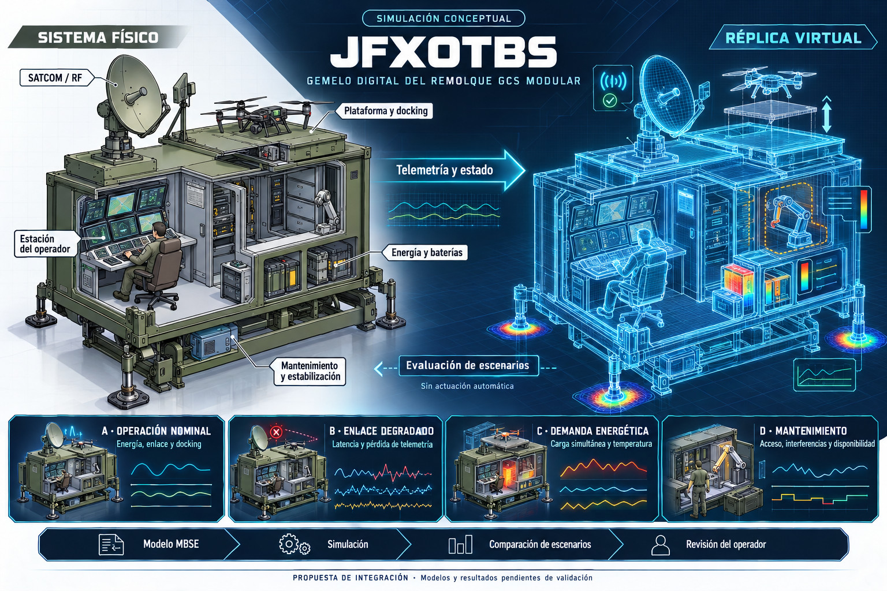
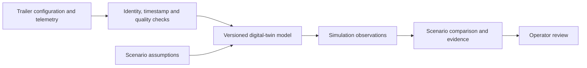

# Open-Architecture Modular GCS Drone Trailer

**Status:** structured English source note and proposed JFXOTBS integration. No operational trailer, protocol compatibility, engineering capacity or simulation result is established by this document.

## 1. Purpose and scope

The source describes a mobile ground control station (GCS) combining a modular trailer with Modular Open Systems Approach (MOSA) principles. It names defense, public safety and advanced industrial drone operations as potential contexts, and envisages one operator interface for uncrewed air, land and maritime fleets from different manufacturers.

The draft says this would eliminate platform lock-in. This is an intended benefit, not a demonstrated result: open interfaces still require compatible implementations, documented contracts and integration tests. The JFXOTBS connection below focuses on equipment readiness, maintenance and simulation; it does not specify tactical operations or implement vehicle control.

## 2. Source systems and capability claims

The following table preserves all four source feature groups and their named technologies and figures. These are unverified draft claims, not procurement specifications or acceptance criteria.

| Feature | Source description | Source-listed capabilities |
| --- | --- | --- |
| Open architecture (MOSA) | Hardware and software intended to avoid proprietary restrictions | MAVLink, STANAG-4586 and ROS integration; third-party software plugins and edge-AI integration |
| Modular GCS interface | Multiple operator workstations and hot-swappable radio compartments | Radio-agnostic bays claimed to support **30+ distinct datalinks**, with Silvus, Wave Relay, SATCOM and MANET RF named as examples |
| Deployable antenna infrastructure | Built-in pneumatic or automated mast structures | Antenna elevation claimed at **8+ meters** using scissor lifts, intended to improve line-of-sight (LOS) and beyond-visual-line-of-sight (BVLOS) connectivity |
| Environmental and power resilience | Self-contained, ruggedized tactical shelter | Dual diesel generators described as **up to 35 kW**, smart UPS backups and “MIL-spec” climate control |

The source does not specify protocol versions, adapters, test coverage, duty cycles, supplier configurations or environmental qualification. Named standards, middleware, vendors and radio categories are not interchangeable interfaces.

The generator wording does not establish whether 35 kW applies to each generator or the combined system, or whether it is continuous or peak output. The antenna height and datalink count have no referenced test or configuration. “MIL-spec” names no particular standard or test outcome. Antenna elevation alone does not demonstrate coverage, BVLOS operational suitability or authorization.

No current technical or regulatory verification was performed as part of this source migration.

## 3. Related concept illustration

The existing repository image pairs a physical cutaway with a virtual replica. It depicts SATCOM/RF, the launch/landing and docking platform, an operator station, energy and battery modules, maintenance equipment and stabilizers. It is a raster concept illustration, not a CAD assembly or executable simulation.

The image's battery/energy module does not establish the source draft's diesel-generator configuration. A future model must select and document its energy architecture rather than treating the prose and illustration as verified equivalents.

## 4. Proposed JFXOTBS integration

This section is an editorial addition linking the source to the existing architecture and illustration.

| Integration area | Proposed information contract | Evidence needed |
| --- | --- | --- |
| Asset and configuration catalog | Trailer/component identity, version and installed module inventory | Consistent IDs across documentation, geometry and telemetry |
| Fleet and maintenance | Equipment availability, charging state, service needs and maintenance records | Traceable state changes and reviewed readiness criteria |
| Communications monitoring | Link identity, timestamps, quality indicators and missing/stale-data status | Defined units, sampling and behavior during unavailable telemetry |
| Energy model | Loads, charging schedules, storage state and thermal-model assumptions | Validated component data and a documented power budget |
| Mechanical and service model | Platform position, stabilizer state and maintenance access | Consistent geometry, loads and model boundaries |
| Simulation evidence | Scenario, model/input versions, assumptions and resulting observations | Repeatable runs and explicit comparison/acceptance rules |

Simulation and advisory outputs remain separate from operational command channels. The proposed workflow does not automatically send commands to vehicles, radios, lifting mechanisms or maintenance equipment.

## 5. Four simulation scenarios

These scenarios are taken from the concept illustration, not from the plaintext source. They define candidate studies rather than completed experiments.

| Scenario | Study scope | Candidate observations |
| --- | --- | --- |
| Nominal operation | Energy, link availability and docking workflow | State consistency, resource availability and sequence completion |
| Degraded link | Latency and missing telemetry | Stale-state detection and uncertainty visible to the operator |
| Energy demand | Simultaneous loads and charging | Energy balance and temperature under declared assumptions |
| Maintenance | Access, interference and equipment availability | Service access, component isolation and readiness changes |

Comparisons must use identifiable configurations, inputs and model versions. Curves, colors and status indicators in the image are illustrative; they do not provide measured performance or validated limits.

## 6. Provenance and navigation

The source was already in English. This migration restructures its prose and flattened table into descriptive Markdown, preserves all four feature groups and numerical claims, and adds explicit evidence boundaries, illustration context and integration scenarios.

- Source snapshot: commit `ca8c38485a58d1f9553f1e6e07c92a4bd308753d`.
- Original filename and migration status: [migration register](../MIGRATION-REGISTER.md).
- Original plaintext remains in Git history.
- [Documentation index](../README.md).
- [Project architecture and CAD catalog](../../README.md#cad-concepts-and-rescue-digital-twins).
